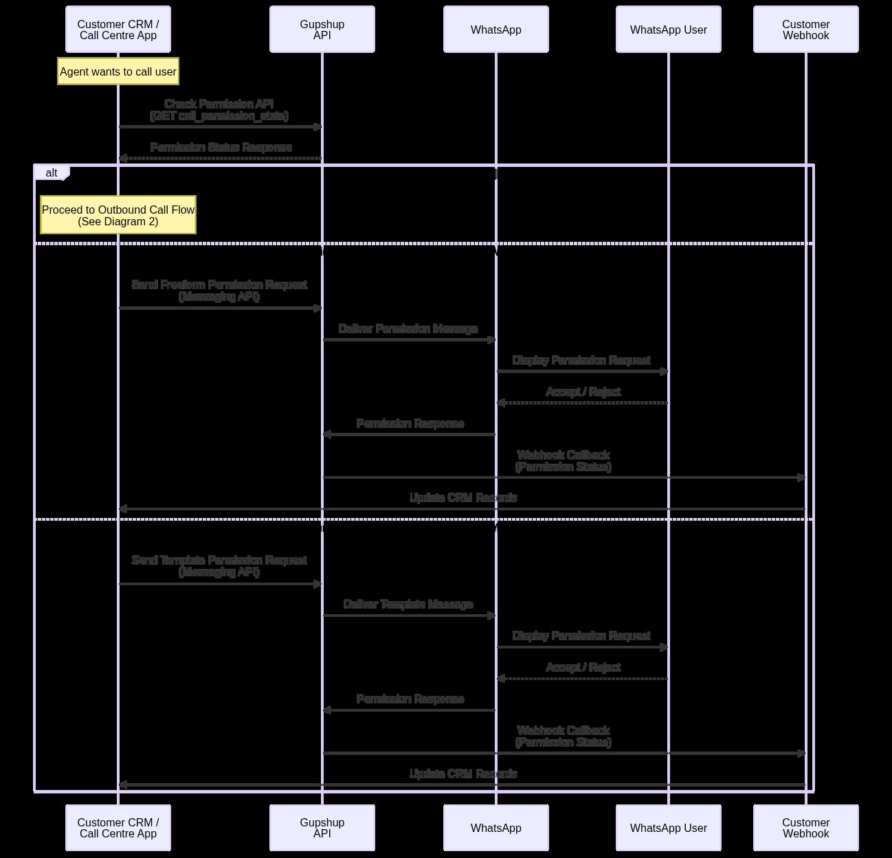
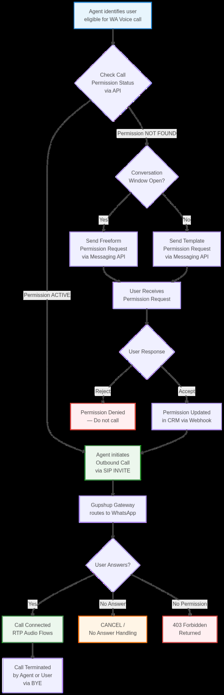

<!-- kb-golden:v1 -->
# WhatsApp Voice SIP — call permissions and SIP errors

**Module**: Integrations

## Call permissions (outbound)

Before making an **outbound** call to a WhatsApp user, you must verify that the user has **granted call permission**. This is an enforced platform requirement.

### Check Call Permission API

**Endpoint (as documented):**

`https://kpi.knowlarity.com/Basic/v1/sr-whatsapp/api/call_permission_state`

**Example request:**

```bash
curl --location \
  'https://kpi.knowlarity.com/Basic/v1/sr-whatsapp/api/call_permission_state' \
  --header 'Content-Type: application/json' \
  --header 'app-id: <app_id>' \
  --header 'x-api-key: <x_api_key>' \
  --data '{"user_phone": <user_phone_number>}'
```

Replace `<app_id>`, `<x_api_key>`, and `<user_phone_number>` with values issued for your integration. The exact JSON shape for `user_phone` should match the format required by the API contract provided with your credentials.

### Key notes on permissions

- Maintain permission state at the **CRM or lead/contact management** layer where possible.
- You do **not** need to check permission in real time before every attempt if you already have a fresh, cached positive result.
- There is **no batch permission API** documented; checks are **per user**.
- If the user has **not** granted permission, outbound SIP attempts can fail with **403** (see below).

### Permission flow

Operationally: obtain consent through WhatsApp messaging flows as required by Meta and your program, persist permission state, call the permission API when needed, and only then originate BIC SIP calls.

Diagram from the SIP integration guide (section 9.2).



### End-to-end outbound flow (with permissions)

High-level integration flow including permissions (section 9.4 in the SIP integration guide).



## Error handling and SIP cause codes

### No call permission (403)

When the user has not granted call permission, you may receive:

`SIP/2.0 403 No Approved Call Permission Found`

**Action:** Do **not** retry the call blindly. Request permission from the user through the **Messaging API** (or your approved consent flow), update your CRM state, then call again only after permission exists.

### No answer / offline (CANCEL)

When the user does not answer or is offline, you may see a reason such as:

`Reason: Q.850;cause=19;text="NO_ANSWER"`

**Action:** Treat as a normal no-answer outcome: retry later or follow your CRM callback policy.

### Media timeout (BYE with cause 500)

When the WhatsApp client ends the call because no media was received for too long:

`Reason: SIP;cause=500;text="WhatsApp client terminated the call due to not receiving any media for a long time."`

**Action:** Verify **RTP** ports **30000–40000** UDP are open, that audio flows in **both** directions, and review **firewall/NAT** rules.

### Incompatible destination (Q.850 cause 88)

`Reason: Q.850;cause=88;text="INCOMPATIBLE_DESTINATION"`

**Action:** Verify **codec** compatibility (**Opus/48000** primary, **G.711** fallback) and that **SDP** parameters align with the documented expectations.

## Related documentation

- Outbound INVITE format and headers: `kb/integrations/whatsapp-voice-sip-outbound-calls.md`
- Network and codecs: `kb/integrations/whatsapp-voice-sip-network-and-media.md`
- FAQ: `kb/integrations/whatsapp-voice-sip-operations-faq.md`
