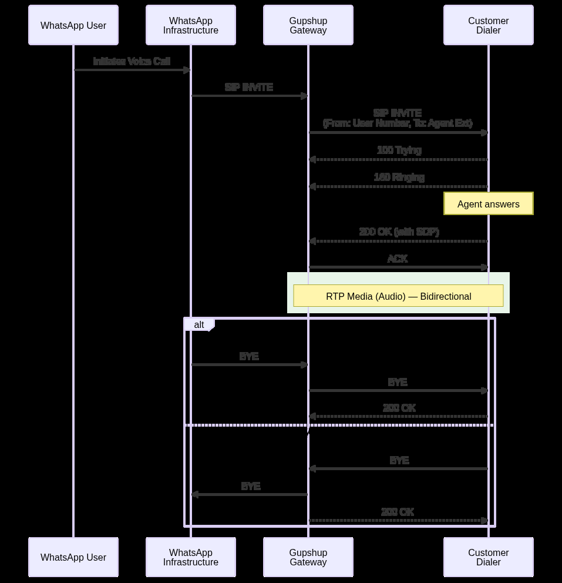

<!-- kb-golden:v1 -->
# WhatsApp Voice SIP — inbound (user-initiated / UIC)

**Module**: Integrations

## Definition

When a WhatsApp user initiates a call to your WABA number, Gupshup receives the call from the WhatsApp infrastructure and forwards it to your configured SIP endpoint as a standard **SIP INVITE** (user-initiated call, **UIC**).

## How inbound calling works

1. The WhatsApp user dials your WABA number from the WhatsApp app.
2. The call is routed to Gupshup.
3. Gupshup sends a **SIP INVITE** to your dialer’s SIP endpoint.
4. Your dialer rings the appropriate agent and answers the call.
5. Audio flows over **RTP** between Gupshup and your dialer.
6. Either party can terminate the call with **BYE**.

## Key headers in inbound INVITE

| Header | Description |
|--------|-------------|
| `From` | The WhatsApp user’s phone number (E.164 format). |
| `To` | The agent extension or routing destination on your dialer. |

## What you provide vs Gupshup

| Item | Owner |
|------|--------|
| SIP endpoint (IP:port) where inbound calls should be sent | Customer |
| WABA number on which WhatsApp Voice must be enabled | Customer |
| Configuration of the provided SIP endpoint for inbound calling | Gupshup |

## Inbound SIP endpoint configuration fields

| Sub-field | Mandatory | Type | Default |
|-----------|-----------|------|---------|
| `host` | Yes | string | — |
| `port` | Yes | string | — |
| `sip_auth_username` | No | string | Blank |
| `sip_auth_password` | No | string | Blank |
| `force_tcp` | No | boolean | `FALSE` |

### Field descriptions

- **host:** IP address or hostname of your SIP server.
- **port:** SIP port (often `5060` for UDP/TCP or `5061` for TLS on your side; signalling toward Gupshup uses the documented gateway port **5072** on the Gupshup side).
- **sip_auth_username / sip_auth_password:** Optional SIP authentication credentials on your trunk.
- **force_tcp:** If `true`, forces use of the TCP protocol for the connection where applicable.

## UIC call flow (signalling sequence)

The SIP message sequence for an inbound WhatsApp Voice call follows the usual INVITE dialog: **INVITE** → provisional responses (for example **100 Trying**, **180 Ringing**) → **200 OK** → **ACK**, then **RTP** audio, and **BYE** → **200 OK** to close. Refer to your dialer’s SIP logs alongside the example INVITE below.

### Diagram (user-initiated / UIC)

Sequence diagram from the SIP integration guide (section 7.1).



## Example — UIC INVITE (Gupshup → dialer)

Illustrative INVITE from the integration guide (placeholders anonymized as in the source):

```
INVITE sip:99xxxxxxxx@<dialer-ip>;transport=tcp SIP/2.0
Via: SIP/2.0/TCP 13.248.195.10:5072;rport;branch=z9hG4bK3tH8K4rK7Qp6j
Max-Forwards: 68
From: <sip:+9190xxxxxxxx@13.248.195.10>;tag=15BHc70UK50Xe
To: <sip:99xxxxxxxx@<dialer-ip>;transport=tcp>
Call-ID: 81xxxxxxxxxxxxxxxxxxxxxxxxxxx
CSeq: 113185150 INVITE
Contact: <sip:mod_sofia@13.248.195.10:5072;transport=tcp>
User-Agent: Gupshup-gs_sip/1.0
Allow: INVITE, ACK, BYE, CANCEL, OPTIONS, MESSAGE, INFO, UPDATE, REGISTER, REFER,
NOTIFY, PUBLISH, SUBSCRIBE
Supported: timer, path, replaces
Content-Type: application/sdp
Content-Disposition: session
X-FB-External-Domain: wa.meta.vc
x-wa-meta-wacid: wacid.IhggQUxxxxxxxxxxxxxxxxxxxxxxxxxxxxxxxxxxx
x-wa-meta-country-code: IN
X-WV-FROM: +9190xxxxxxxx
X-WV-TO: +9198xxxxxxxx
X-WV-CALLID: outgoing:wacid.IhggQUxxxxxxxxxxxxxxxxxxxxxxxxxxxxxxxxxxx
```

After the dialog is established, the inbound flow continues with RTP audio until **BYE**.

## Routing and agent desktop metadata

Call routing is handled by your dialer. Gupshup can include **custom SIP headers** on the INVITE (for example caller identifiers and WhatsApp-related metadata as in the sample). Your dialer can parse these headers to drive routing rules or to populate the agent desktop.
