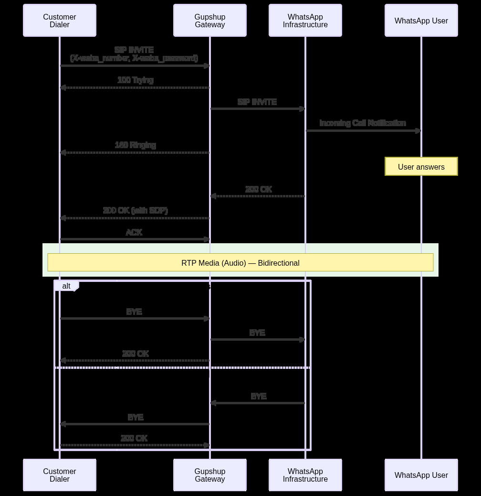

<!-- kb-golden:v1 -->
# WhatsApp Voice SIP — outbound (business-initiated / BIC)

**Module**: Integrations

## Definition

For **outbound** calls (agent-to-user, **BIC**), your dialer initiates a **SIP INVITE** toward the Gupshup voice gateway. Gupshup routes the call to the WhatsApp user on the WhatsApp network.

You must comply with **call permission** requirements before placing outbound calls; see `kb/integrations/whatsapp-voice-sip-call-permissions-and-errors.md`.

## Call request format

Direct the initial **SIP INVITE** to:

`sip:{{customer_number}}@wavoicetls.knowlarity.com:5072`

Replace `{{customer_number}}` with the destination number in the format required for your integration (E.164 style as used in examples in the SIP guide).

## Required custom SIP headers (X-headers)

Include the following headers on the **initial INVITE** so the gateway can authenticate and route the call:

| Header name | Description | Placeholder |
|-------------|-------------|-------------|
| `X-waba_number` | Your WABA identification value | `{{waba_number}}` |
| `X-waba_password` | Your secure API/SIP password | `{{waba_password}}` |

## Example — minimal INVITE shape (dialer → Gupshup)

```
INVITE sip:{{customer_number}}@wavoicetls.knowlarity.com:5072 SIP/2.0
Via: SIP/2.0/UDP your-source-ip:port
From: <sip:{{waba_number}}@your-domain.com>;tag=12345
To: <sip:{{customer_number}}@wavoicetls.knowlarity.com>
X-waba_number: 91XXXXXXXXXX
X-waba_password: your_secure_password
Content-Type: application/sdp
```

Use a valid SDP body matching the negotiated codecs (see the network and media guide).

## Example — BIC INVITE (pattern from integration guide)

```
INVITE sip:919XXXXXXXXX@wavoicetls.knowlarity.com:5072 SIP/2.0
Via: SIP/2.0/UDP <dialer-ip>:5090;report;branch=z9hG4bKxxxxxxx
Max-Forwards: 69
From: "1001" <sip:1001@<dialer-ip>>;tag=xxxxxxx
To: <sip:919XXXXXXXXX@wavoicetls.knowlarity.com:5072>
Call-ID: xxxxxxxx-xxxx-xxxx-xxxx-xxxxxxxxxxxx
CSeq: 105664876 INVITE
Content-Type: application/sdp
X-waba_number: 55XXXXXXXXXX
X-waba_password: <your_secure_password>
```

## BIC call flow (signalling sequence)

Outbound signalling follows a standard SIP INVITE transaction toward `wavoicetls.knowlarity.com:5072`, then progress through ringing, answer, RTP, and teardown. Exact provisional response names and timing depend on WhatsApp and network conditions; treat **403** responses on permission failures as **non-retryable** without first obtaining user consent (see errors and permissions topic).

### Diagram (business-initiated / BIC)

Sequence diagram from the SIP integration guide (section 7.2).



## TLS, SRTP, and recording

- **TLS (signalling):** The customer documentation states TLS is used on the **upstream** SIP leg; for the **Gupshup-to-customer** leg, consult Gupshup about enabling TLS on your SIP trunk if required.
- **SRTP:** Supported for media encryption; recording over SRTP is mentioned as supported. Configuration is done with Gupshup for your trunk.
- **Recording:** By default recording may be done on your dialer or recorder; Gupshup can alternatively record and provide a URL (commercial arrangement). Each recording is associated with the SIP **Call-ID**.

Details on error codes and permission checks are in the companion articles in this folder.
