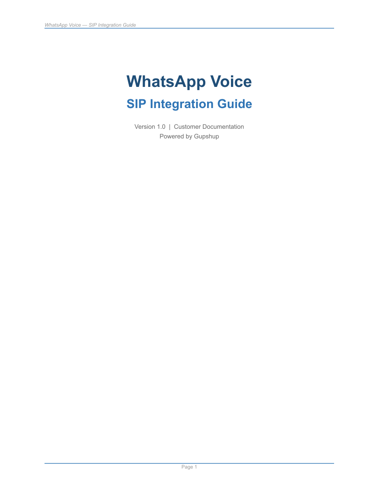

<!-- kb-golden:v1 -->
# WhatsApp Voice SIP integration — overview

**Module**: Integrations

## Introduction

WhatsApp Voice enables end-customers to initiate and receive calls via WhatsApp, creating a unified messaging and voice experience. Gupshup facilitates this capability through SIP (Session Initiation Protocol) integrations with your contact-centre or dialer infrastructure.

This documentation summarizes the customer SIP integration guide (Version 1.0) for implementing WhatsApp Voice calls through the Gupshup gateway:

- **Inbound (user-initiated, UIC):** The WhatsApp user calls your WABA number; Gupshup forwards a SIP INVITE to your SIP endpoint.
- **Outbound (business-initiated, BIC):** Your dialer sends a SIP INVITE to the Gupshup gateway; the call is routed to the WhatsApp user.

### Reference — customer SIP guide (cover)

The following image is exported from the **WhatsApp Voice — SIP Integration Guide** (Version 1.0, customer documentation) PDF bundled with this knowledge base.

## Prerequisites

Before you begin the integration, ensure the following are in place.

| Requirement | Details |
|---------------|---------|
| WABA number | Active WhatsApp phone number configured on Gupshup (Console). |
| Audio codec | Primary: **Opus/48000**. Optional fallback: **PCMA/8000** (G.711). |
| Call routing | Seamless forwarding with no failures configured on the dialer side. |
| Firewall | No blocking of SIP or RTP traffic (see the network and firewall guide in this KB). |
| Media | RTP requirements met (see media and RTP requirements in this KB). |

## Where this fits

- **Provisioning:** You supply your WABA number for WhatsApp Voice enablement and, for inbound calls, your SIP endpoint details. Gupshup configures the SIP path on the platform side as described in the inbound and outbound guides.
- **Operational:** Your team manages firewall rules, dialer configuration, optional call-permission checks before outbound calls, and monitoring (codec, RTP, SIP response codes).

## Related topics in this knowledge base

- Network, firewall, and media: `kb/integrations/whatsapp-voice-sip-network-and-media.md`
- Inbound (UIC): `kb/integrations/whatsapp-voice-sip-inbound-calls.md`
- Outbound (BIC): `kb/integrations/whatsapp-voice-sip-outbound-calls.md`
- Call permissions and SIP errors: `kb/integrations/whatsapp-voice-sip-call-permissions-and-errors.md`
- Recordings, DTMF, checklist, FAQ: `kb/integrations/whatsapp-voice-sip-operations-faq.md`
